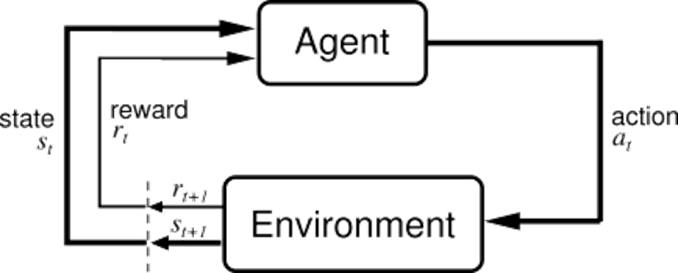

# Proyecto de Optimización de un proceso industrial de secado por aspersión, Spray Drying

Implementación de un enfoque de Optimización de una función de recompensa para maximizar el rendimiento económico de la planta industrial, mediante DDPG, AWR y AWR+.

## Archivos principales

Los archivos más relevantes del repositorio son:

### Modelo de ensamble para simular el entorno

- **[modelo_torre_v0.py](modelo_torre_v0.py):** modelo de ensamble para simular el proceso de secado

- **[modelo_torre_v0_test.py](modelo_torre_v0_test.py):** pruebas de desempeño del modelo de ensamble

### Redes Crítico y Actor

- **[warmup_actor_DDPG_v0.py](warmup_actor_DDPG_v0.py):** entrenamiento de la red Actor

- **[warmup_critic_DDPG_v0.py](warmup_critic_DDPG_v0.py):** entrenamiento de la red Crítico

### Modelo DDPG

- **[torre_DDPG_v0.py](torre_DDPG_v0.py):** entrenamiento del modelo DDPG

- **[torre_DDPG_v0_test.py](torre_DDPG_v0_test.py):** pruebas de desempeño del modelo DDPG

- **[torre_DDPG_v1.py](torre_DDPG_v1.py):** entrenamiento del modelo DDPG con Gamma

- **[torre_DDPG_v1_test.py](torre_DDPG_v1_test.py):** pruebas de desempeño del modelo DDPG con Gamma

### Modelo AWR

- **[AWR_v0.py](AWR_v0.py):** entrenamiento del modelo AWR

- **[AWR_v0_test.py](AWR_v0_test.py):** pruebas de desempeño del modelo AWR

- **[AWR_Grid_v0.py](AWR_Grid_v0.py):** entrenamiento de varios modelos AWR, para sintonizar hiperparámetros

- **[AWR_Grid_test.py](AWR_Grid_test.py):** pruebas de desempeño de varios modelos AWR o AWR+

- **[AWR_Grid_v1_ReLu.py](AWR_Grid_v1_ReLu.py):** entrenamiento de varios modelos AWR con tratamiento ReLU, para sintonizar hiperparámetros

### Modelo AWR+

- **[AWR_buffer_Grid_v0.py](AWR_buffer_Grid_v0.py):** entrenamiento de varios modelos AWR+, para sintonizar hiperparámetros

- **[AWR_buffer_Grid_v1_ReLu.py](AWR_buffer_Grid_v1_ReLu.py):** entrenamiento de varios modelos AWR+ con tratamiento ReLU, para sintonizar hiperparámetros

## Variables del Proceso

El modelo dinámico en `predict_net.py` utiliza un conjunto de variables de entrada (`list_cols`) para predecir un conjunto de variables de salida (`list_PREDICT`). En el contexto de la optimización D-RTO implementada en `optimizing_net.py`, estas variables tienen los siguientes roles:

-   **Variables de Entrada al Modelo (`list_cols`)**:
    Son todas las variables del proceso que sirven como entrada al modelo dinámico `predict_model.keras` para predecir el siguiente estado.

    -   **Variables de Decisión (`list_decision_vars`)**:
        Subconjunto de `list_cols` que son controladas por el optimizador D-RTO. El optimizador ajusta iterativamente los valores de estas variables para maximizar la recompensa predicha. Corresponden a las variables originalmente identificadas como 'list_no_predict' en el entrenamiento del predictor.
        *   Status_Spray_Drying
        *   Tower_PMC_Controller_Enabled
        *   Producto_A
        *   Producto_B
        *   Producto_C
        *   Bombeo_HP_TT_0355
        *   Bombeo_Slurry_Densidad
        *   Bombeo_Slurry_Humedad_HT_P401
        *   Torre_Horno_Temp_Aire
        *   Torre_Horno_Temp_Gas
        *(Total: 10 variables)*

    -   **Entradas Fijas (`list_fixed_inputs`)**:
        Subconjunto de `list_cols` que se consideran como entradas dadas o disturbios durante un ciclo de optimización del D-RTO. El optimizador no ajusta estas variables. Incluyen las variables de estado y acción no definidas como variables de decisión.
        *(Total: 24 variables, el resto de list_cols)*

-   **Variables de Salida del Modelo (`list_PREDICT`)**:
    Son las variables del proceso cuyo valor en el siguiente paso de tiempo es predicho por el modelo dinámico. La función de recompensa `cal_reward.py` utiliza un subconjunto de estas variables predichas para calcular la recompensa del estado futuro.
    *(Total: 24 variables, el resto de variables en list_cols después de excluir list_no_predict)*

## Descripción de las variables

Para la implementación del D-RTO, las variables del proceso se clasifican y utilizan de la siguiente manera en relación con el modelo dinámico y el optimizador:

### Variables de perturbación

*(En la implementación actual del D-RTO (`optimizing_net.py`), estas variables corresponden a las **Variables de Decisión** (`list_decision_vars`) que son optimizadas.)*

Las diez variables marcadas como "Perturbación" en la hoja Definitivos_35 del excel "DESCRIPCIÓN DE DATOS Rev 2.xlsx" son variables que en los modelos se utilizarán como si fuesen estados del Entorno, sin embargo, en la vida real, obedecen a condiciones de entrada externas al proceso, causadas por procesos anteriores a la torre de secado o condiciones de la planta. Estas son:

**No**	**Variable**  
2	Status_Spray_Drying  
3	Tower_PMC_Controller_Enabled  
4	Producto_A  
5	Producto_B  
6	Producto_C  
13	Bombeo_HP_TT_0355  
18	Bombeo_Slurry_Densidad  
19	Bombeo_Slurry_Humedad_HT_P401  
20	Torre_Horno_Temp_Aire  
21	Torre_Horno_Temp_Gas  

### Variables de estado del proceso

*(En la implementación actual del D-RTO (`optimizing_net.py`), estas variables corresponden a una parte de las **Entradas Fijas** (`list_fixed_inputs`) para el optimizador y a las variables de **Salida Predicha** (`list_PREDICT`) del modelo dinámico que se utilizan para calcular la recompensa.)*

Las siguientes 16 variables, marcadas en el excel como Controlada y Manipulada, son los estados reales de la planta

**No**	**Variable**   
9	Bombeo_Low_Pump_FT_0355_Kg_h  
11	P404_High_Pump_Pressure_CV  
12	P404_High_Pump_Pressure_PV  
15	Bombeo_Aero_Boost_FT_0371_Kg_h  
17	Bombeo_Aero_Boost_PT_0371_BAR  
23	Tower_Input_Air_Fan_Speed_Feedback  
24	Flujo_de_aire_Horno  
26	Torre_Horno_Flujo_Gas  
27	Tower_Input_Temperature_PV  
29	Tower_Internal_Pressure_CV  
30	Tower_Internal_Pressure_Mean  
31	Torre_Techo_TT_0414_C  
32	Torre_PB_Flujo_Schenck  
33	Torre_PB_Humedad_MT_500  
34	F501_Ciclone_01_Speed  
35	TT5011_Dry_Cyclon_01_Temperature  

### Variables de Acción

*(En la implementación actual del D-RTO (`optimizing_net.py`), estas variables corresponden a una parte de las **Entradas Fijas** (`list_fixed_inputs`) para el optimizador y a las variables de **Salida Predicha** (`list_PREDICT`) del modelo dinámico.)*

Las siguientes ocho variables son las salidas que debe calcular la red "Red_optimizacion_secado" para optimizar económicamente la operación del proceso

**No**	**Variable**   
7	Number_of_Jets_Open  
8	Bombeo_Low_Pump_P_401  
10	P404_High_Pump_Pressure_SP  
14	Apertura_Valvula_Flujo_Aeroboost_FCV_0371  
16	Apertura_Valvula_Presion_Aeroboost  
22	Tower_Input_Air_Fan_Speed_Ref  
25	Tower_Input_Temperature_SP  
28	Tower_Internal_Pressure_SP  

----------

# Aprendizaje por refuerzo (Reinforcement Learning)

El aprendizaje por refuerzo, o Reinforcement Learning, no se considera una técnica de aprendizaje supervisado ni tampoco una de aprendizaje no-supervisado, sino que se considera de una clase diferente (Géron, 2017). Se trata de una técnica de machine learning en donde un _Agente_ (Agent), interactúa con un _Entorno_ (Environment), sin conocimiento previo de este y pretende maximizar una _Recompensa_ (Reward), como se representa en la Figura 2. La idea principal es que, a través de varias iteraciones, el agente va experimentando sus posibles _Acciones_ (Actions) en los diversos _Estados_ (States) en los que se puede encontrar el entorno, aprendiendo y memorizando las acciones que le brindan la mejor recompensa para cada combinación _Estado_-_Acción_. Esta estrategia que acaba aprendiendo el _Agente_ se denomina _Política_ (Policy) y es la que utilizará el _Agente_ para reaccionar ante eventos futuros, esperando maximizar la _Recompensa_.

Figura 2. Interacción Agente-Entorno en el aprendizaje por refuerzo

**Nota:** Adaptado de (Sutton & Barto, 2005), http://www.incompleteideas.net/book/ebook/node28.html

Dentro de los parámetros más relevantes para el entrenamiento de este tipo de modelos (Proellochs & Feuerriegel, 2020), se encuentran:

•	**Tasa de aprendizaje (learning rate):** se utiliza para controlar cuánto se ajustan los valores de las Acciones en cada iteración. Un valor en cero, significaría que el Agente no aprendería y uno muy alto, cercano a unos, significaría que intentaría aprender muy rápido y podría ocasionar que el modelo no converja  

•	**Descuento (Discount factor):** este parámetro se utiliza para asignar la importancia de las recompensas futuras en comparación con las inmediatas. Cuando es cercano a uno, significa que el agente valora las recompensas futuras casi tanto como las inmediatas, mientras que, si se encuentra cercano a cero, el agente se entrenará teniendo en cuenta recompensas a corto plazo. Por ejemplo, si se estuviera entrenando un agente para jugar ajedrez y este parámetro es cercano a cero, el agente podría empezar la partida tratando de tomar rápidamente las piezas del contrincante, una estrategia que a corto plazo le podría servir, mas cuando se enfrente a un jugador calificado posiblemente tenga poco éxito 

•	**Exploración vs. Explotación (Exploration vs. Exploitation):** este parámetro controla la estrategia que seguirá el agente para decidir si explora nuevas alternativas, exploración, cuando su valor es más cercano a uno o si prefiere utilizar el conocimiento que ya aprendió, explotación, cuando su valor es más cercano a cero

•	**Número de Episodios (Epochs):** este es el número de iteraciones que el _agente_ realizará interactuando con el _Entorno_ parar aprender. Normalmente entre más iteraciones se realicen, mejor entrenado quedará el _agente_, por supuesto, consumiendo más tiempo y recursos de procesamiento

----

### Scripts Principales

- **eda.py** - Análisis exploratorio de datos
  - Genera reporte HTML con estadísticas básicas
  - Usa `ydata_profiling` para análisis rápido

- **tf_optimize.py** - Entrenamiento principal del modelo DQN
  - Implementa el agente `DQNAgent` con memoria de repetición
  - Hiperparámetros configurables
  - Guarda el modelo entrenado como `dqn_model.h5`
  - Genera gráficos de progreso del entrenamiento (`training_progress.png`)

- **optimizing_net.py** - Dynamic Real-Time Optimization (D-RTO)
  - Implements an optimization strategy to maximize predicted reward.
  - Uses a trained neural network model to predict the next state.
  - Leverages TensorFlow for defining decision variables, objective function, and optimization loop.
  - Calculates a differentiable reward using TensorFlow operations (`calculate_differentiable_reward`) for gradient-based optimization.
  - Uses the original `RewardCalculator` to evaluate the final optimized result.
  - Key parameters: `OPTIMIZATION_STEPS`, `OPTIMIZATION_LEARNING_RATE`
  - *Note: Updated to address a gradient-related issue for improved stability and accuracy.*

- **test_model.py** - Validación del modelo entrenado
  - Carga el modelo y realiza pruebas unitarias
  - Compara recompensa predicha vs real
  - Manejo seguro de datos de entrada

- **cal_reward.py** - Cálculo de función de recompensa
  - Clase `RewardCalculator` con validación de datos
  - Carga pesos desde CSV (`pesos.csv`)
  - Métricas basadas en `Torre_PB_Flujo_Schenck`

- **optimize_dqn.py** - Optimización de hiperparámetros
  - Búsqueda en grid con combinaciones predefinidas
  - Guarda resultados en `optimization_results.json`
  - Parámetros optimizables: gamma, tasa de aprendizaje, tamaño de capas

---------
